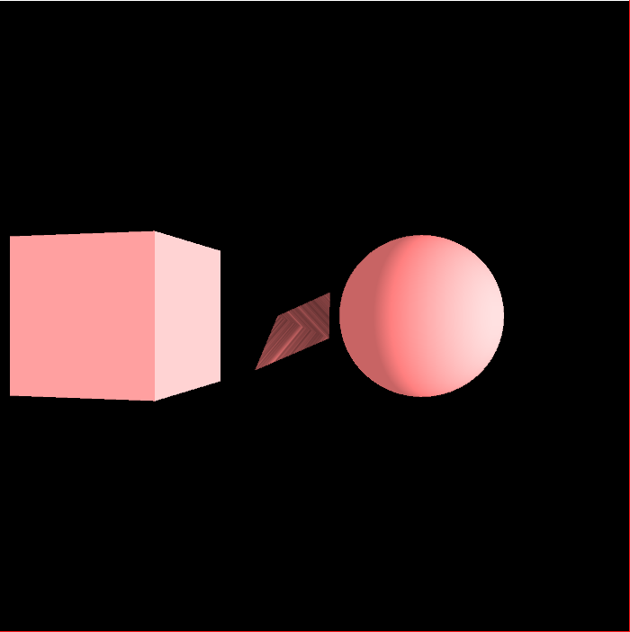

# processing
Work I've done for intro to magd using processing
## Project 5
Used pushable buttons to change the display. Squares and circles were used to make patterns within the program. 
## Project 6
Two player pong game with "WASD" and the arrow keys used to control the paddles. 
## Project 7
Users can move "player" or square by pressing the arrow keys. Trees continually generate on the sides to create a forest look. 
## Project 8
Generated different text and combined the headings with an image to create a movie poster style project. 
## Project 9
Plays a mirrored video of a tiger with a matching sound effect. Sound effect also has reverb and effects on it. 
## Project 10
Generated 3D objects in front of a black background. Users can use the arrow keys to move around the shapes and switch their camera angle.

